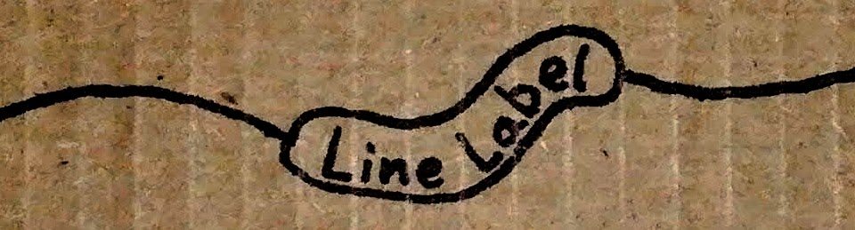

<a name="cardboard"></a>
# LineLabel
JavaScript library for adding inline labels to any SVG path. Useful for roadmaps, diagrams, and most especially [Nøde](https://github.com/treefrogman/NodeOpDevEnvironment).

__Table of Contents__  
- [Constructor](#constructor)
- [Methods](#methods)
- [Example](#example)


# Constructor

<pre>
<b>lineLabel</b>( path, text, layers, <i>options</i> );
</pre>

## Parameters
#### `path`  
The SVG element to which the label shall be shaped.

#### `text`  
The text content of the label.

#### `layers`
An array, in stacking order, of layer objects. Each layer object has two keys:
- `elem`  
	A string, either `'text'` or `'back'`, indicating which graphical element this layer should instantiate.

- `css`  
	The CSS class name to apply to the element.

#### `options`
An object containing any of the following key-value pairs.
- `trim: [ 0, 0 ]`  
	For the purpose of calculating lengths and positions, pretend the path is longer or shorter on each end. Lengths are in pixels; positive numbers shorten the path.
	
- `flip: 0b00` <i><sub>v2 milestone</sub></i>  
	Flip the text before shaping it to the path. A pair of bits representing horizontal and vertical flip respectively. Margins and baseline shift are flipped as well.
	
- `margins: [ 0, 0 ]`  
	Increase (or decrease) margins on left and right ends of text. Lengths are in pixels; positive numbers lengthen the background.
	
- `yOffset: 0`  
	Adjust the baseline shift / y offset. Positive numbers raise text.

- `spacing: [ min = 0, max = 68 ]`  
	Minimum and maximum spacing for multiple labels along the path. For short paths only a single centered label is drawn, or nothing if the space is too small. If there's room with `min` between, the one label is replaced with a label at each end of the path. When those labels are more than `max` apart, another label is added in between. This patterns goes on, distributing labels along the path so they are never more than `max` apart.

- `single: false` <i><sub>v2 milestone</sub></i>  
	Disable the aforementioned label distribution method, and create a single label instead.

- `align: left | center | right` <sub>(only applicable in `single` mode) <i>v2 milestone</i></sub>  
	Align the label on the path. `trim`, `flip`, and `margins` are taken into account in calculating the final placement.

# Methods
### <pre>path( <i>path</i> )</pre>
Get or set the SVG element to which the label shall be shaped.

### <pre>text( <i>text</i> )</pre>
Get or set the text content of the label.

### <pre>layers( <i>layers</i> )</pre>
Get or replace the array of layer objects.

### <pre>options( <i>options</i> )</pre>
- `options()`  
	Get the current options. Returns the options object, with an additional property called `defaults`, containing all the default options, and a method `option( option name )` to get the dominant value for a given option.
- `options( options )`  
	Set options. Does not unset any previously set options. To reset an option to default, assign a value of `null` to it in the options object. To reset all, pass a `null` value to the `options` method.

### <pre>element()</pre>
Return an SVG group element containing all graphical components.

### <pre>update()</pre>
Update all graphical components. Should be called manually after making any changes to the label or the path's `d` attribute.

# Example
_This would produce something close to [the one I sharpied onto the cardboard at the top of this page](#cardboard)_
```css
.labelBorder, .labelBack {
	stroke-linecap: round;
	fill: none;
}
.labelBorder {
	stroke-width: 1.1em;
	stroke: black;
}
.labelBack {
	stroke-width: 1em;
	stroke: white;
}
.labelText {
	/* Actually, I think the default style might do the trick on this one */
}
```

```js
var xmlns = "http://www.w3.org/2000/svg";
var path = document.createElementNS( xmlns, 'path' );
path.setAttributeNS( xmlns, curvyPathData );
var text = "Line Label";
var layers = [
	{ elem: 'back', css: 'labelBorder' },
	{ elem: 'back', css: 'labelBack' },
	{ elem: 'text', css: 'labelText' }
];
var label = lineLabel( path, text, layers );
```


# Roadmap
A good bit of the functionality has [already been implemented in the Nøde codebase](https://github.com/treefrogman/NodeOpDevEnvironment/blob/master/js/connector.js), but needs to be refactored and made more customizable.

The API has been specified, but needs review and possible refinement before moving into development.

After finalizing the API, I would like to write a test suite before diving into the thick of it. I need to research options for graphical testing.
